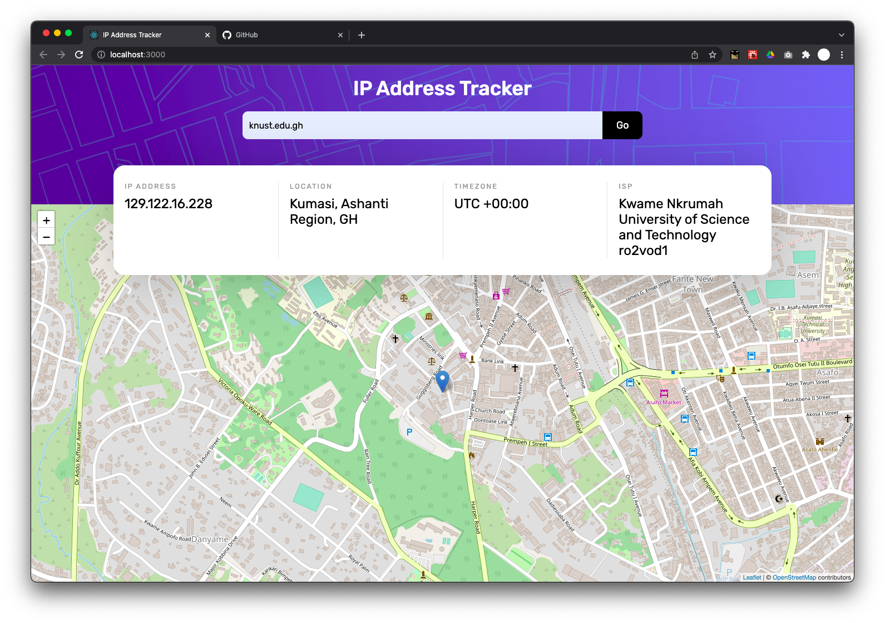
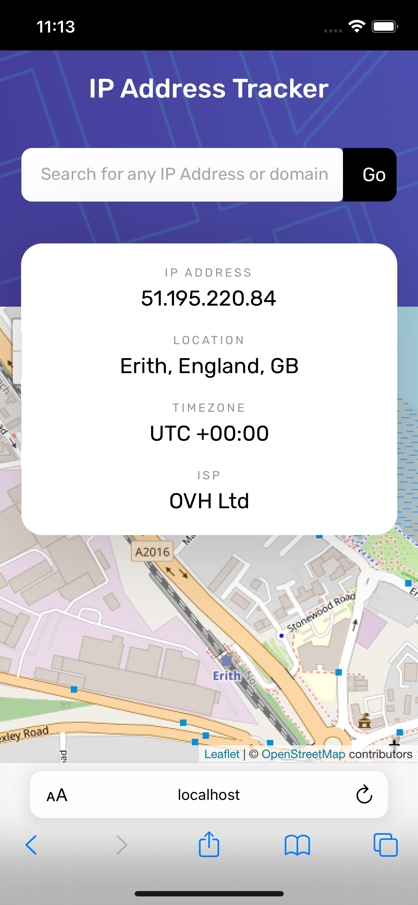

# Frontend Mentor - IP address tracker solution

This is a solution to the [IP address tracker challenge on Frontend Mentor](https://www.frontendmentor.io/challenges/ip-address-tracker-I8-0yYAH0). Frontend Mentor challenges help you improve your coding skills by building realistic projects.

## Table of contents

- [Overview](#overview)
    - [The challenge](#the-challenge)
    - [Screenshot](#screenshot)
    - [Links](#links)
- [My process](#my-process)
    - [Built with](#built-with)
- [Author](#author)

## Overview

### The challenge

Users should be able to:

- View the optimal layout for each page depending on their device's screen size
- See hover states for all interactive elements on the page
- See their own IP address on the map on the initial page load
- Search for any IP addresses or domains and see the key information and location

### Screenshot
<table>
  <tr>
    <td>

    </td>
    <td>

</td>
  </tr>
</table>

### Links

- Solution URL: [https://www.frontendmentor.io/challenges/ip-address-tracker-I8-0yYAH0/hub/ip-address-tracker-built-with-reactjs-K6So6Kl0M](https://www.frontendmentor.io/challenges/ip-address-tracker-I8-0yYAH0/hub/ip-address-tracker-built-with-reactjs-K6So6Kl0M)
- Live Site URL: [https://ip-address-tracker-614.netlify.app/](https://ip-address-tracker-614.netlify.app/)

## My process

### Built with

- Flexbox
- CSS Grid
- [React](https://reactjs.org/) - JS library
- [Styled Components](https://styled-components.com/) - For styles
- [React-Leaflet](https://react-leaflet.js.org/) - For the Map
- [IP Geolocation API by IPify](https://geo.ipify.org/)

## Author

- Website - [Isaac Anohene](https://anohene1.github.io)
- Frontend Mentor - [@anohene1](https://www.frontendmentor.io/profile/anohene1)
- Twitter - [@anohene1](https://www.twitter.com/anohene1)
